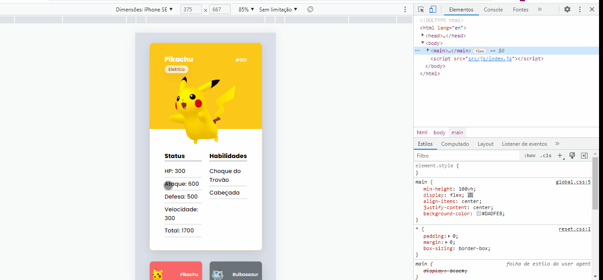

# Projeto-Pokedex-MDW

## Descrição:
    Bem-vindo! 👋
    Obrigado por conferir o projeto Pokédex, realizado no MapaDev Week, aqui utilizamos JS para mudarmos as cartas de acordo com o pokémon escolhido, aqui também deixamos responsivos.
    

 
 
## Técnologias Utilizadas:
    HTML 5
    CSS 3
    Flex
    Responsivo
    JavaScript
    

